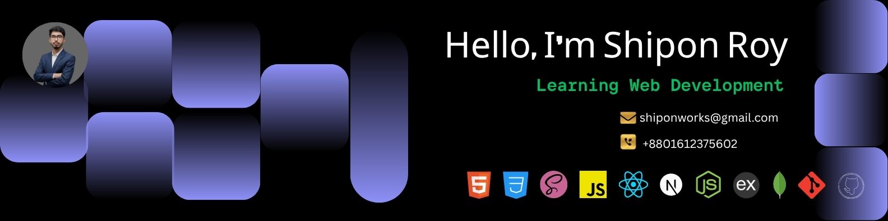
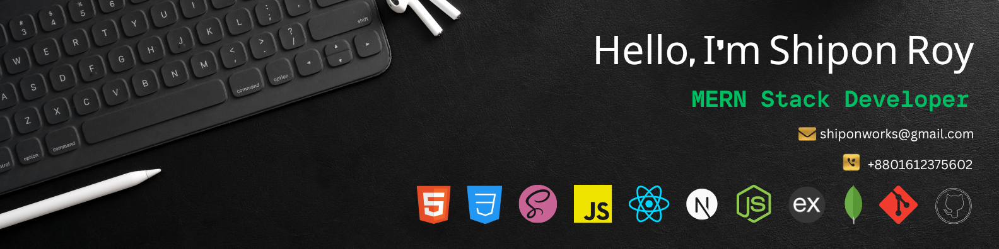

<!-- Banner 1 -->
<!--  -->

<!-- Banner 2 -->
<!--  -->

<!-- Banner 3 -->

 

  

## 🚀 About Me

I am a MERN Stack Web Developer focused on building modern, scalable, and
high-performance web applications using React, Next.js, Node.js, Express.js, and
MongoDB.

I have completed 45+ projects, including 2 collaborative team projects, where I
gained hands-on experience in full-stack development, API integration,
responsive UI design, and real-world problem-solving.

I enjoy writing clean, maintainable code and continuously improving my skills
through practical development and team collaboration using Git & GitHub.

🎯 Focus Building scalable full-stack applications, improving backend
architecture, and delivering clean, user-friendly digital experiences.

<!-- ---------- 💻 Tech Stack Section  ---------- -->

<h2 align="center">💻 Technologies I Work With</h2>

  
  
  
  
  
  
  
  
  
  
  

<!-- ---------- ☕ Connect with me! ---------- -->

<h2 align="left"> ☕ Connect with me! </h2>

  
  
  
  
  

📧 <a href="mailto:shiponworks@gmail.com">shiponworks@gmail.com</a>
&nbsp; | &nbsp;
💬 <a href="https://wa.me/8801952470881">WhatsApp</a>
&nbsp; | &nbsp;
📞 <a href="tel:+8801612375602">+8801612375602</a>

<h2></h2>

<table align="center" style="background-color:#ebfcfc; border-radius:12px; padding:12px;">
  <tr>
    <td style="padding:6px;">
      
    </td>
    <td style="padding:6px;">
      
    </td>
  </tr>
</table>
